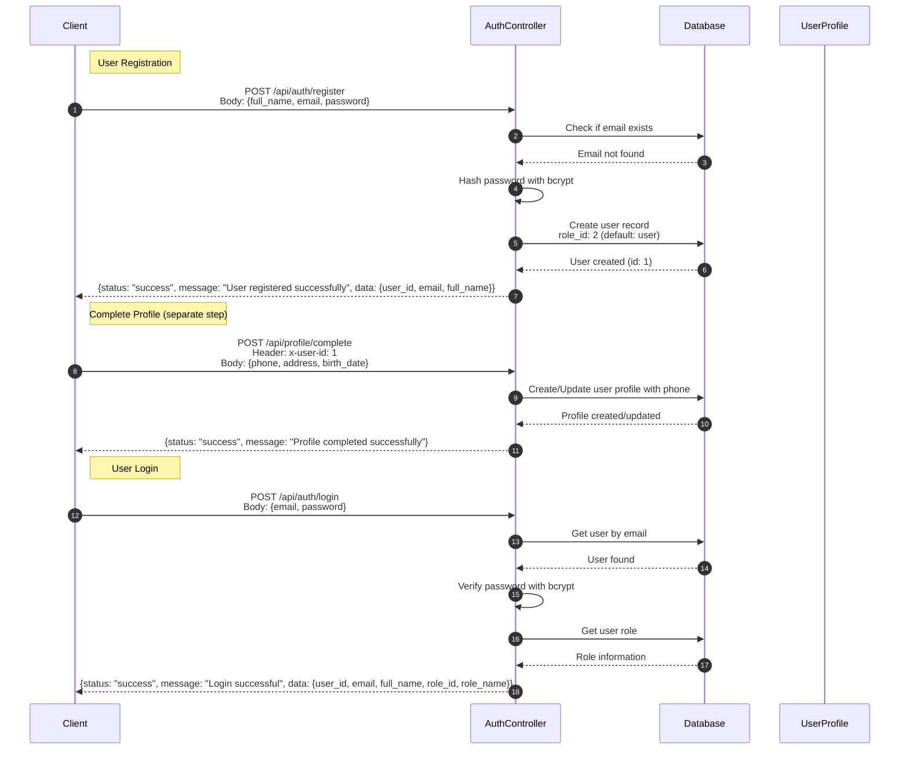
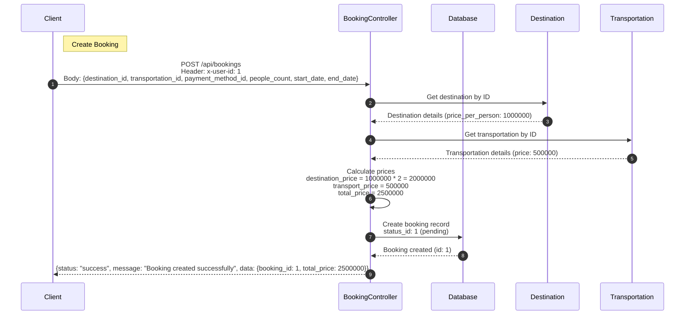
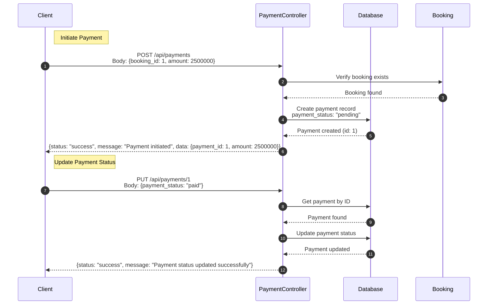
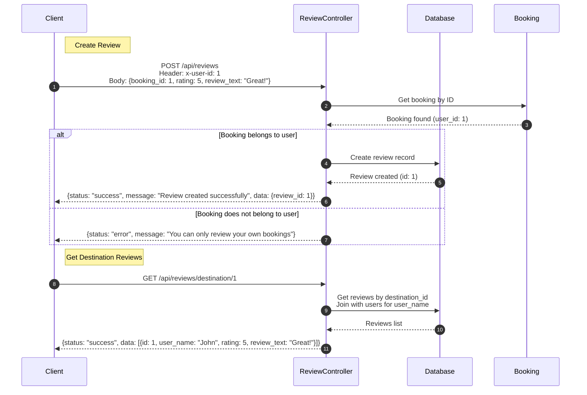
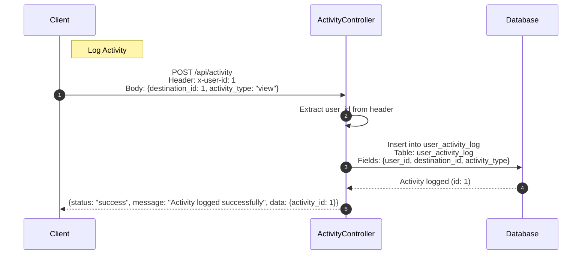

# Trava-be (Go)

Backend API for Trava travel booking application built with Go, Gin, and GORM (MySQL).

## Features

- User authentication and authorization
- User management (CRUD operations)
- Role-based access control (Admin & User)
- Destination management
- Booking system
- Payment processing
- Review system
- Activity logging
- Express.js compatible response format
- Gin web framework
- GORM (MySQL)

## Getting Started

### 1. Prerequisites

- Go 1.21 or higher
- MySQL 8.0 or higher
- Git

### 2. Clone the repository

```bash
git clone https://github.com/Rifq11/Trava-be
cd Trava-be
```

### 3. Install dependencies

```bash
go mod download
```

### 4. Configure database

Edit `Config/config.go` dan sesuaikan database connection string:

```go
dsn := "root@tcp(127.0.0.1:3306)/trava?charset=utf8mb4&parseTime=True&loc=Local"
```

Ganti dengan:
- `root` → MySQL username
- `127.0.0.1:3306` → MySQL host dan port
- `trava` → Database name

### 5. Setup database

Pastikan database MySQL sudah dibuat dan tabel-tabel sudah ada (menggunakan schema dari Express backend atau Drizzle migrations).

### 6. Build and run

#### Development:

```bash
go run main.go
```

#### Production (build first):

```bash
go build -o trava-be .
./trava-be
```

Aplikasi akan berjalan di `http://localhost:8080`.

---

## API Endpoints

### Auth

- `POST /api/auth/register` — Register user
  - Requires: `full_name`, `email`, `password`
  - Optional: `role_id` (default: 2 for user, 1 for admin)
  - Phone number will be filled in complete profile step
- `POST /api/auth/login` — Login user
- `PUT /api/auth/profile` — Update own profile (requires auth)
  - Can update: `full_name`, `email`, `phone`, `address`, `birth_date`, `password`

### Profile

- `GET /api/profile` — Get user profile (requires auth)
- `PUT /api/profile/complete` — Complete/update user profile with photo upload (requires auth)
  - Supports multipart/form-data for image upload
  - Fields: `user_photo` (file), `phone`, `address`, `birth_date`, `is_admin`

### Destinations

- `GET /api/destinations` — List destinations (public)
  - Query params: `category_id` (optional)
- `GET /api/destinations/:id` — Get destination by ID (public)
- `POST /api/destinations` — Create destination with image upload (requires auth)
  - Supports multipart/form-data for image upload
  - Fields: `image` (file), `category_id`, `name`, `description`, `location`, `price_per_person`
- `PUT /api/destinations/:id` — Update destination with image upload
  - Supports multipart/form-data for image upload
  - All fields optional (partial update)
- `DELETE /api/destinations/:id` — Delete destination

### Bookings

- `POST /api/bookings` — Create booking (requires auth)
- `GET /api/bookings/my` — Get my bookings (requires auth)

### Payments

- `POST /api/payments` — Initiate payment
- `PUT /api/payments/:id` — Update payment status

### Reviews

- `POST /api/reviews` — Create review (requires auth)
- `GET /api/reviews/destination/:id` — Get reviews by destination

### Activity

- `POST /api/activity` — Log user activity (requires auth)

### Users

- `GET /api/users` — Get all users
- `GET /api/users/:id` — Get user by ID
- `POST /api/users` — Create user
- `PUT /api/users/:id` — Update user
- `DELETE /api/users/:id` — Delete user

---

## API Flow Diagrams

### 1. User Registration & Login Flow



### 2. Booking Flow



### 3. Payment Flow



### 4. Review Flow



### 5. Activity Logging Flow



---

## File Upload

Aplikasi mendukung upload gambar untuk:
- **Profile Photo** - User dan Admin profile photos
- **Destination Images** - Gambar destinasi wisata

### Upload Configuration

- **Max file size**: 10MB
- **Allowed formats**: JPEG, PNG, WebP
- **Storage location**: `public/uploads/`
- **Access URL**: `/uploads/filename.jpg`
- **Database storage**: URL lengkap disimpan di database (contoh: `/uploads/filename-1234567890.jpg`)

### Upload Helper

Upload helper tersedia di `helper/upload.go`:

- `UploadSingle(fieldName)` - Middleware untuk single file upload
- `UploadMultiple(fieldName, maxCount)` - Middleware untuk multiple files upload
- `GetFileUrl(filename)` - Convert filename ke URL
- `DeleteFile(filename)` - Hapus file dari uploads directory

### Upload Profile Photo

**Endpoint:** `PUT /api/profile/complete`

**Content-Type:** `multipart/form-data`

**Headers:**
```
x-user-id: 1
```

**Form Data:**
- `user_photo`: [file upload] (optional - bisa upload file baru)
- `phone`: "081234567890" (optional)
- `address`: "Jl. Contoh No. 123" (optional)
- `birth_date`: "1990-01-01" (optional)
- `is_admin`: false (optional)

**Contoh dengan cURL:**
```bash
curl -X PUT http://localhost:8080/api/profile/complete \
  -H "x-user-id: 1" \
  -F "user_photo=@/path/to/photo.jpg" \
  -F "phone=081234567890" \
  -F "address=Jl. Contoh No. 123" \
  -F "birth_date=1990-01-01" \
  -F "is_admin=false"
```

**Contoh tanpa upload file (pakai URL existing):**
```bash
curl -X PUT http://localhost:8080/api/profile/complete \
  -H "x-user-id: 1" \
  -F "user_photo=/uploads/existing-photo.jpg" \
  -F "phone=081234567890"
```

**Response:**
```json
{
  "status": "success",
  "message": "Profile completed successfully"
}
```

**Note:** File yang di-upload akan disimpan dengan nama unik: `originalname-timestamp-random.ext` dan URL lengkap (`/uploads/filename.jpg`) akan disimpan di database.

### Upload Destination Image

**Endpoint:** `POST /api/destinations` (Create) atau `PUT /api/destinations/:id` (Update)

**Content-Type:** `multipart/form-data`

**Headers:**
```
x-user-id: 1
```

**Form Data (Create):**
- `image`: [file upload] (optional - bisa upload file baru)
- `category_id`: 1 (required)
- `name`: "Bali Beach" (required)
- `description`: "Beautiful beach in Bali" (optional)
- `location`: "Bali, Indonesia" (required)
- `price_per_person`: 500000 (required)

**Contoh Create dengan cURL:**
```bash
curl -X POST http://localhost:8080/api/destinations \
  -H "x-user-id: 1" \
  -F "image=@/path/to/destination.jpg" \
  -F "category_id=1" \
  -F "name=Bali Beach" \
  -F "description=Beautiful beach in Bali" \
  -F "location=Bali, Indonesia" \
  -F "price_per_person=500000"
```

**Form Data (Update):**
- `image`: [file upload] (optional - bisa upload file baru atau pakai URL existing)
- `category_id`: 1 (optional)
- `name`: "Updated Name" (optional)
- `description`: "Updated description" (optional)
- `location`: "Updated location" (optional)
- `price_per_person`: 600000 (optional)

**Contoh Update dengan cURL:**
```bash
curl -X PUT http://localhost:8080/api/destinations/1 \
  -F "image=@/path/to/new-image.jpg" \
  -F "name=Updated Destination Name"
```

**Contoh Update tanpa upload (pakai URL existing):**
```bash
curl -X PUT http://localhost:8080/api/destinations/1 \
  -F "image=/uploads/existing-image.jpg" \
  -F "name=Updated Name"
```

**Response (Create):**
```json
{
  "status": "success",
  "message": "Destination created successfully",
  "data": {
    "id": 1
  }
}
```

**Response (Update):**
```json
{
  "status": "success",
  "message": "Destination updated successfully"
}
```

### Mengakses File yang Di-upload

File yang sudah di-upload dapat diakses melalui URL:

```
GET http://localhost:8080/uploads/filename-1234567890.jpg
```

File akan otomatis di-serve sebagai static file dari `public/uploads/` directory.

### Response Format untuk Image URL

Ketika mengambil data dari API, field image akan berisi URL lengkap:

**Get Profile:**
```json
{
  "status": "success",
  "data": {
    "user": { ... },
    "profile": {
      "user_photo": "/uploads/profile-1234567890.jpg"
    }
  }
}
```

**Get Destinations:**
```json
{
  "status": "success",
  "data": [
    {
      "id": 1,
      "name": "Bali Beach",
      "image": "/uploads/destination-1234567890.jpg"
    }
  ]
}
```

### Error Handling

**File terlalu besar:**
```json
{
  "status": "error",
  "message": "File size exceeds maximum limit of 10MB"
}
```

**Format file tidak didukung:**
```json
{
  "status": "error",
  "message": "Invalid file type. Only JPEG, PNG, and WebP images are allowed."
}
```

**Gagal menyimpan file:**
```json
{
  "status": "error",
  "message": "Failed to save file"
}
```

---

## Authentication & Authorization

### Middleware

Aplikasi menggunakan middleware untuk authentication dan authorization:

#### Authentication Middleware
- `RequireAuth()` - Memverifikasi user sudah login
- Mengambil `user_id` dari header `x-user-id` atau `user-id`, query parameter `user_id` atau `userId`
- Menambahkan user info ke context (`user_id`, `user_email`, `user_full_name`, `user_role_id`, `user_role_name`)

#### Authorization Middleware
- `RequireAdmin()` - Hanya admin yang bisa akses (kombinasi RequireAuth + role check)

### Request Headers

Untuk mengakses protected routes, kirim `user_id` di header:

```
x-user-id: 1
```

atau

```
user-id: 1
```

**Note:** Di production, sebaiknya gunakan JWT token untuk authentication.

---

## Response Format

Semua response menggunakan format yang sama dengan Express backend:

### Success Response

```json
{
  "status": "success",
  "message": "Operation successful",
  "data": { ... }
}
```

### Error Response

```json
{
  "status": "error",
  "message": "Error message"
}
```

### Example Responses

#### Success with data:
```json
{
  "status": "success",
  "data": [
    {
      "id": 1,
      "full_name": "John Doe",
      "email": "john@example.com",
      "role_id": 2,
      "role_name": "user"
    }
  ]
}
```

#### Success with message:
```json
{
  "status": "success",
  "message": "User created successfully",
  "data": {
    "user_id": 1,
    "email": "john@example.com",
    "full_name": "John Doe"
  }
}
```

#### Error:
```json
{
  "status": "error",
  "message": "User not found"
}
```

---

## Struktur Direktori

```
Trava-be/
├── Config/
│   └── config.go          # Database connection
├── Controller/
│   ├── auth.go            # Auth controller
│   ├── booking.go         # Booking controller
│   ├── destination.go     # Destination controller
│   ├── payment.go         # Payment controller
│   ├── profile.go         # Profile controller
│   ├── review.go          # Review controller
│   ├── user.go            # User controller
│   └── activity.go        # Activity controller
├── Helper/
│   └── upload.go          # File upload utilities
├── Middleware/
│   └── auth.go            # Authentication & authorization middleware
├── Models/
│   ├── auth.go            # Auth models
│   ├── booking.go         # Booking models
│   ├── destination.go     # Destination models
│   ├── payment.go         # Payment models
│   ├── profile.go         # Profile models
│   ├── review.go          # Review models
│   ├── user.go            # User models
│   ├── activity.go        # Activity models
│   └── response.go        # Response models
├── Routes/
│   ├── auth.go            # Auth routes
│   ├── booking.go         # Booking routes
│   ├── destination.go     # Destination routes
│   ├── payment.go         # Payment routes
│   ├── profile.go         # Profile routes
│   ├── review.go          # Review routes
│   ├── user.go            # User routes
│   ├── activity.go        # Activity routes
│   └── routes.go          # Main routes setup
├── server/
│   └── main.go            # Entry point
├── public/
│   └── uploads/           # Uploaded files directory
├── go.mod                 # Go module dependencies
├── go.sum                 # Go module checksums
└── README.md              # This file
```

---

## Dependencies

- **Gin** (v1.10.0) - Web framework
- **GORM** (v1.25.12) - ORM for database operations
- **GORM MySQL Driver** (v1.5.7) - MySQL driver for GORM
- **bcrypt** (golang.org/x/crypto v0.28.0) - Password hashing

---

## Development

### Run in development mode:

```bash
go run main.go
```

### Build for production:

```bash
go build -o trava-be .
./trava-be
```

### Run with hot reload (install air first):

```bash
go install github.com/cosmtrek/air@latest
air
```

---

## API Testing

### Example: Register User

```bash
curl -X POST http://localhost:8080/api/auth/register \
  -H "Content-Type: application/json" \
  -d '{
    "full_name": "John Doe",
    "email": "john@example.com",
    "password": "password"
  }'
```

**Note:** Phone number is not required during registration. It will be filled when completing the profile via `POST /api/profile/complete`.

### Example: Login

```bash
curl -X POST http://localhost:8080/api/auth/login \
  -H "Content-Type: application/json" \
  -d '{
    "email": "john@example.com",
    "password": "password"
  }'
```

### Example: Get Profile (requires auth)

```bash
curl -X GET http://localhost:8080/api/profile \
  -H "x-user-id: 1"
```

### Example: Create Booking (requires auth)

```bash
curl -X POST http://localhost:8080/api/bookings \
  -H "Content-Type: application/json" \
  -H "x-user-id: 1" \
  -d '{
    "destination_id": 1,
    "transportation_id": 1,
    "payment_method_id": 1,
    "people_count": 2,
    "start_date": "2024-12-01 10:00:00",
    "end_date": "2024-12-03 18:00:00"
  }'
```

### Example: Complete Profile with Photo Upload

```bash
curl -X PUT http://localhost:8080/api/profile/complete \
  -H "x-user-id: 1" \
  -F "user_photo=@/path/to/photo.jpg" \
  -F "phone=081234567890" \
  -F "address=Jl. Contoh No. 123" \
  -F "birth_date=1990-01-01"
```

### Example: Create Destination with Image Upload

```bash
curl -X POST http://localhost:8080/api/destinations \
  -H "x-user-id: 1" \
  -F "image=@/path/to/destination.jpg" \
  -F "category_id=1" \
  -F "name=Bali Beach" \
  -F "description=Beautiful beach in Bali" \
  -F "location=Bali, Indonesia" \
  -F "price_per_person=500000"
```

---

## Notes

- Database schema harus sudah ada (dari Express backend migrations)
- Password di-hash menggunakan bcrypt dengan cost 10
- Default booking status: 1 (pending)
- Default user role: 2 (user)
- Admin role: 1 (admin)
- Upload directory (`public/uploads/`) akan otomatis dibuat saat aplikasi pertama kali dijalankan
- File yang di-upload akan disimpan dengan nama unik untuk menghindari konflik
- URL lengkap (contoh: `/uploads/filename.jpg`) disimpan di database, bukan hanya filename
- File dapat diakses langsung melalui URL: `http://localhost:8080/uploads/filename.jpg`

---

## License

MIT

